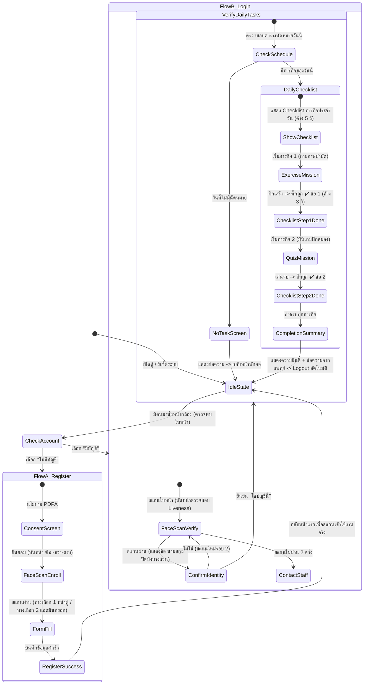

# ลำดับขั้นตอนการทำงาน (User Flow) ฝั่งผู้ใช้งานตู้ Kiosk
## Dr.Tech.Care — ตู้กายภาพบำบัดอัจฉริยะ 9:16

เอกสารนี้กำหนดลำดับขั้นตอนการทำงานจริง (User Journey & State Machine) บนตู้ Kiosk เพื่อให้เชื่อมโยงกับฐานข้อมูล Supabase และหน้าแอดมินแบบ Real-time ตามข้อกำหนด

---

## 1. ผังรวมขั้นตอนการทำงาน (State Machine Flow)

---

## 2. รายละเอียดแต่ละสถานะ (Step-by-step Implementation)

### 2.1 หน้าจอพักเครื่อง (Idle State)
- **การแสดงผล**: เมื่อยังไม่มีคนมานั่ง หน้าจอแสดงโลโก้โปรเจกต์ `Dr.Tech.Care` กึ่งกลางหน้าจอ โทนสีเขียวหยกและไล่ระดับตาม Design Token
- **ระบบกล้องสแตนด์บาย**: กล้องเบราว์เซอร์เปิดทำงานแบบ Low-power Face Detection เมื่อคนไข้เดินมานั่งที่เก้าอี้หน้าตู้:
  - โลโก้เลื่อนขึ้นด้านบนแบบ Smooth Transition (Framer Motion)
  - หน้าจอแสดงภาพสดจากกล้อง (ลักษณะส่องกระจก Mirror CSS: `scaleX(-1)`)
  - นำทางเข้าสู่หน้า **ตรวจสอบบัญชี (Check Account)** ทันที

### 2.2 หน้าจอตรวจสอบบัญชี (Check Account)
- **ข้อความหลัก**: *"คุณมีบัญชีกายภาพอยู่แล้วหรือไม่?"*
- **การควบคุม (Dual-mode)**:
  - **ปุ่มสัมผัสขนาดใหญ่**: ปุ่ม "ไม่มี" (ซ้าย - สีน้ำเงิน) และ "มี" (ขวา - สีเขียวหยก) ขนาด ≥ 96×96px
  - **ระบบกวาดมือแบบ Contactless (AI Pose / Hand Detection)**: ผู้ใช้สามารถยกมือไปแตะบริเวณขอบจอซ้ายหรือขวาเพื่อเลือกโดยไม่ต้องแตะหน้าจอจริง

### 2.3 กรณี ก: ผู้ป่วยใหม่ (เลือก "ไม่มีบัญชี") — Flow A
1. **หน้าความยินยอม PDPA**: แจ้งวัตถุประสงค์การเก็บ Face Embedding (ไม่เก็บภาพถ่ายหรือวิดีโอ)
2. **สแกนใบหน้าลงทะเบียน (Liveness Challenge)**:
   - ผู้ป่วยมองตรงที่กล้อง (`center`)
   - หันซ้ายช้า ๆ (`left`)
   - หันขวาช้า ๆ (`right`)
   - คำนวณ 128-d Vector Embedding และตรวจจับความซ้ำซ้อนกับบัญชีเดิม
3. **การกรอกข้อมูล**:
   - *ทางเลือกที่ 1 (หน้าตู้)*: กรอกชื่อ นามสกุล อายุ เพศ ผ่าน Virtual Thai Keyboard / NumPad
   - *ทางเลือกที่ 2 (หลังบ้าน)*: เจ้าหน้าที่/แพทย์กรอกข้อมูลและจัดสรรนักกายภาพผ่านหน้า Admin Dashboard
4. **สมัครสำเร็จ**: แสดงหน้าจอ *"สมัครบัญชีสำเร็จ"* ค้าง 3-5 วินาที
5. **สิ้นสุดกระบวนการสมัคร**: เรียก `resetKioskState({ redirectToHome: true })` กลับหน้าแรกสุดเพื่อให้คนไข้สแกนล็อกอินจริง

### 2.4 กรณี ข: ผู้ป่วยเก่า (เลือก "มีบัญชี") — Flow B
1. **สแกนใบหน้าเข้าสู่ระบบ**:
   - ระบบตรวจจับ Liveness และส่ง Embedding probe ไปยังฟังก์ชัน `match_face` บนเซิร์ฟเวอร์
   - ตัดสินตัวตนด้วย `decideIdentity()`
2. **ยืนยันข้อมูล**:
   - แสดงการ์ดชื่อ-นามสกุลที่ปิดบังบางส่วน (เช่น *"ธนากร ว****"*) และอายุ
   - ข้อความ: *"ใช่บัญชีนี้หรือไม่?"* ผู้ป่วยเลือก [ยืนยันการใช้งาน] หรือ [ไม่ใช่]
   - *กรณีไม่ใช่*: สแกนใหม่รอบที่ 2 (ตัดรายชื่อที่ถูกปฏิเสธออก)
   - *กรณีล้มเหลว 2 ครั้ง*: แสดงข้อความ *"ระบบจำใบหน้าไม่ได้ กรุณาติดต่อเจ้าหน้าที่"*
3. **ล็อกอินสำเร็จ**: แสดงข้อความ *"ล็อกอินสำเร็จ สวัสดีคุณ..."* และสร้าง Supabase Auth Session จริง

### 2.5 ระบบตรวจสอบภารกิจประจำวัน (Daily Task Verification)
- Query ตาราง `schedule_entries` ของผู้ป่วยคนนั้นในวันที่ปัจจุบัน (`scheduled_date = CURRENT_DATE`)
- **กรณีที่ 1 (ไม่มีภารกิจ)**:
  - แสดงข้อความ: *"วันนี้แพทย์ไม่ได้มีการนัดหมายกายภาพ"*
  - ค้าง 5 วินาทีแล้ว Logout อัตโนมัติกลับสู่หน้าพักเครื่อง
- **กรณีที่ 2 (มีภารกิจ)**:
  - นำทางเข้าสู่หน้า **Daily Checklist** ทันที

### 2.6 หน้าจอภารกิจประจำวัน (Daily Checklist & Mission)
1. **แสดง Checklist รายการสิ่งที่ต้องทำ**:
   - ภารกิจที่ 1: กายภาพบำบัดประจำวัน (ชื่อท่า, จำนวนครั้ง/เซต)
   - ภารกิจที่ 2: เล่นมินิเกมฝึกสมอง (ชุดคำถาม)
2. **Auto-advance (5 วินาที)**:
   - นับถอยหลัง 5 วินาทีเพื่อให้ผู้ป่วยอ่านและเตรียมพร้อม
   - นำทางเข้าสู่ภารกิจที่ 1 อัตโนมัติ
3. **ทำภารกิจที่ 1 เสร็จ**:
   - บันทึกผลลงตาราง `exercise_sessions` และ `rep_events`
   - นำทางกลับมาที่หน้า Checklist
   - แสดงเครื่องหมายถูกสีเขียว (✔️) หน้าภารกิจที่ 1
   - นับถอยหลัง 3 วินาทีเพื่อเข้าสู่ภารกิจที่ 2 อัตโนมัติ
4. **ทำภารกิจที่ 2 เสร็จ**:
   - บันทึกผลลงตาราง `quiz_attempts` และ `quiz_answers`
   - นำทางกลับมาที่หน้า Checklist
   - แสดงเครื่องหมายถูกสีเขียว (✔️) หน้าภารกิจที่ 2
   - นำทางเข้าสู่หน้าสรุปผล

### 2.7 สิ้นสุดภารกิจประจำวัน (Completion Screen)
- **หน้าจอสรุปผล**: แสดงข้อความ *"ยินดีด้วย คุณทำกายภาพรายวันเสร็จสิ้นแล้ว!"* พร้อมเหรียญความสำเร็จ
- **คำแนะนำจากแพทย์**: ดึงโน้ตล่าสุดจาก `physio_notes` ที่ตั้งค่า `visible_to_patient = true`
- **สิ้นสุดการทำงาน**: นับถอยหลัง 10 วินาที (หรือกดปุ่ม "เสร็จสิ้น") -> เรียก `resetKioskState()` -> Logout ปิดกล้อง ล้างเซสชัน กลับสู่หน้าพักเครื่อง

---

## 3. สถาปัตยกรรม Real-time Sync (ตู้ Kiosk ⟷ Admin Dashboard)

- **ฐานข้อมูลเดียว 100%**: ทุกตารางอยู่ในฐานข้อมูล Supabase เดียวกัน
- **Supabase Realtime**:
  - เมื่อแอดมินกำหนดตารางกายภาพใหม่ใน `/admin/schedule` ➔ หน้าตู้ของผู้ป่วยอัปเดต Checklist ทันที
  - เมื่อคนไข้ทำกายภาพเสร็จหรือแจ้งอาการผิดปกติ ➔ หน้าแอดมินของแพทย์/นักกายภาพได้รับ Notification และตัวเลขสถิติอัปเดตแบบ Realtime โดยไม่ต้องกด Refresh หน้าเว็บ
